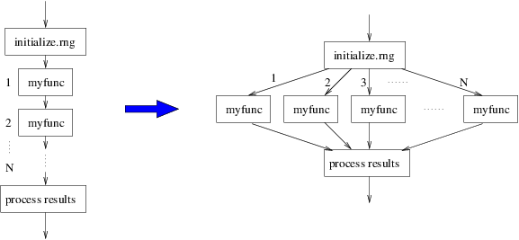
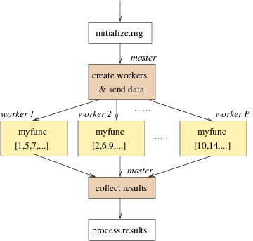
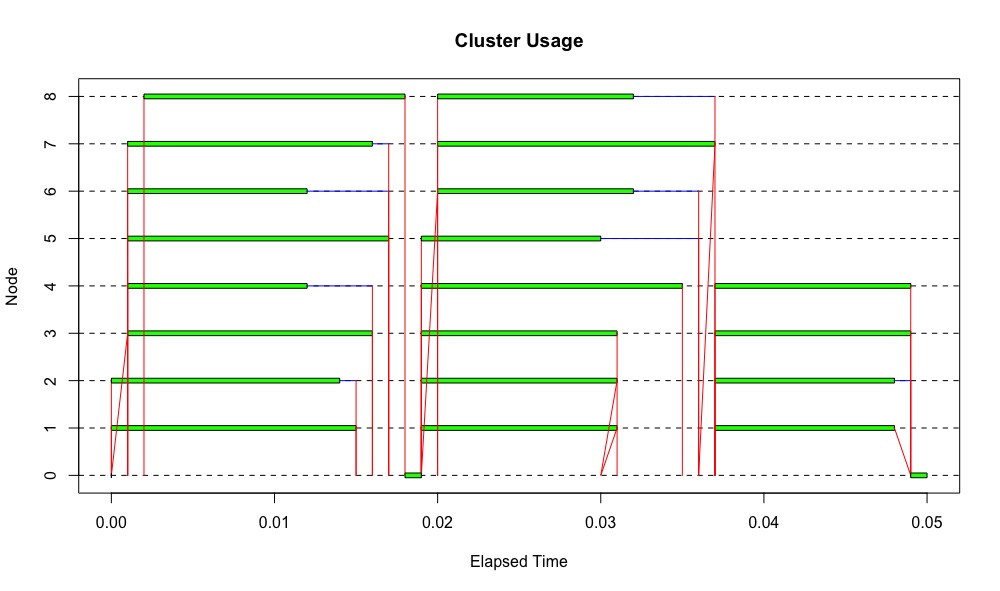
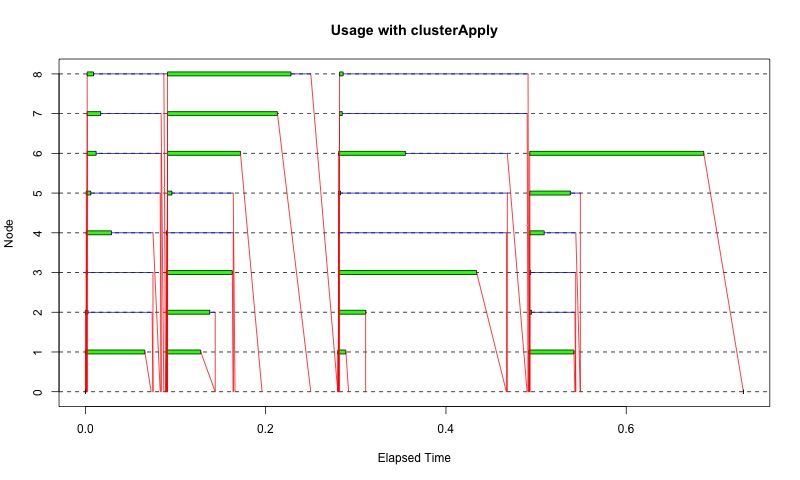
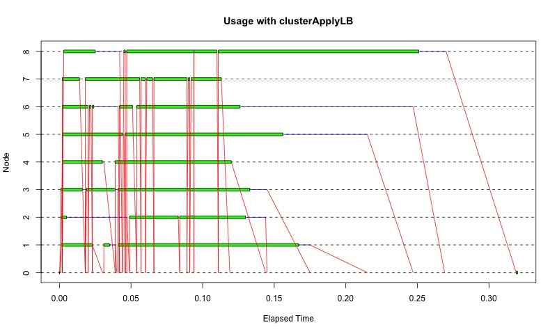
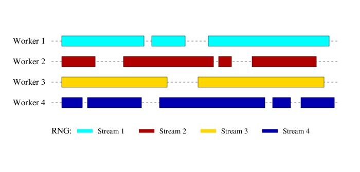
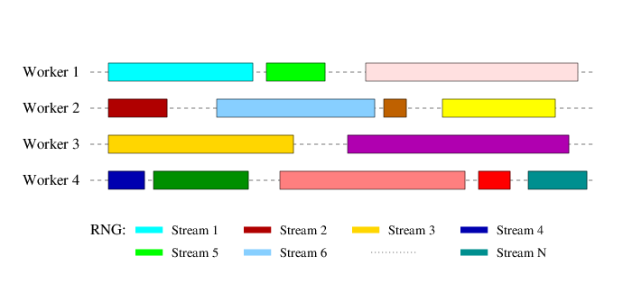
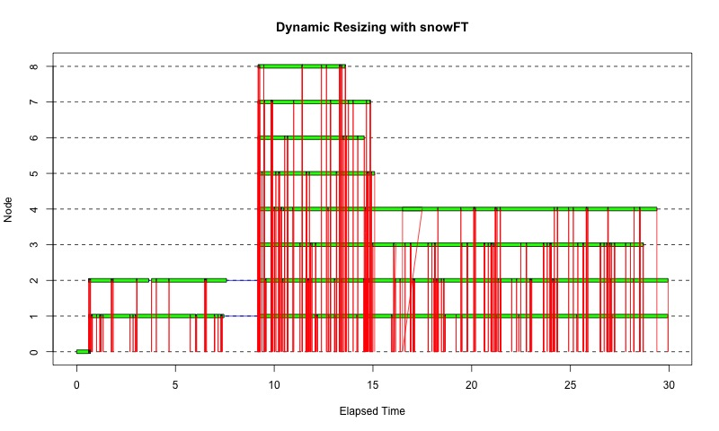
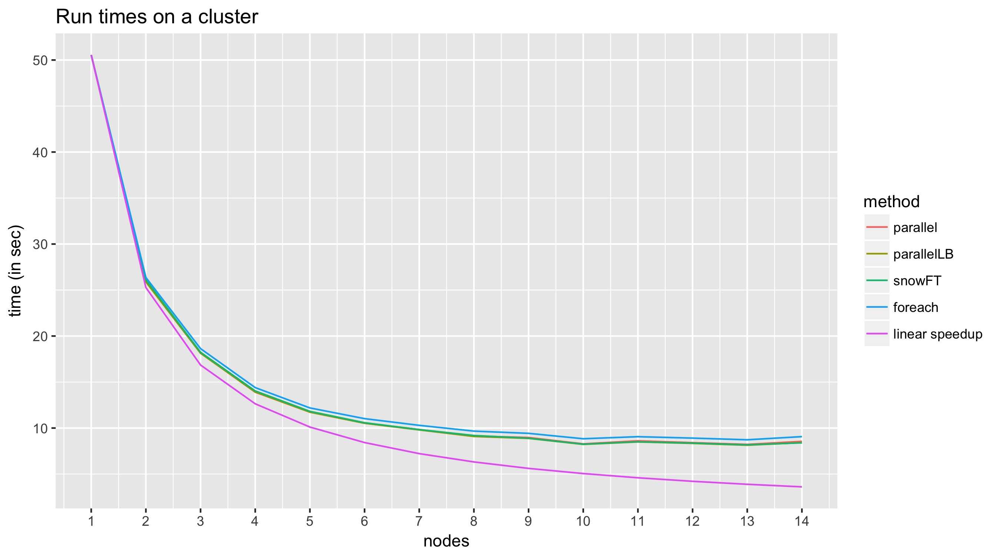

```{r setup, include=FALSE}
knitr::opts_chunk$set(echo = TRUE)
eval <- FALSE
```

# Required Packages

Please install the following packages:

```{r eval=FALSE}
install.packages(c("foreach", "doParallel", "doRNG", 
                   "snowFT", "extraDistr", "ggplot2", 
                   "reshape2", "wpp2017"), 
                 dependencies = TRUE)
```


# Structure of Statistical Simulations

Many statistical simulations have the following structure:

```{r eval=FALSE}
initialize.rng(...)
for (iteration in 1:N) {
    result[iteration] <- myfunc(...)
}
process(result,...)
```

If calls of `myfunc` are independent of one another, we can transform the simulation as follows:



# Master-slave Paradigm

* A cluster consists of a master and a set of workers, usually one worker per physical node.
* Each worker is responsible for one or more calls of `myfunc`.
* Master is responsible for sending workers everything they need and for collecting results.



* Usually, number of workers P is much smaller than the number of tasks N.

There are many packages in R that work in this fashion. One of the first packages, **snow** (Simple Network of Workstations) has been recently re-implemented as an R core package called **parallel**. 

# Package parallel

* The [**parallel**](https://stat.ethz.ch/R-manual/R-devel/library/parallel/doc/parallel.pdf) package contains implementations of two packages:
    * **snow** (Luke Tierney at al)
    * **multicore** (Simon Urbanek)

* The **snow** part works for homogeneous as well as heterogeneous clusters on any OS.
* The **multicore** part works for Mac/Unix/Linux OS (not Windows) and is designed for multi CPU/core single computers  with shared memory. It's main functions are `mclapply`, `mcmapply` and `mcMap`. 
* In this tutorial we will focus on the **snow** part of **parallel**. 

## Setup

* Load the package and check how many cores you have:

    ```{r eval=eval}
library(parallel)
detectCores() # counts hyperthreaded cores
P <- detectCores(logical = FALSE) # physical cores
P
```

## Start and Stop a Cluster

* Start and stop a pool of workers with one worker per core:

    ```{r eval=eval}
cl <- makeCluster(P)
cl
typeof(cl)
length(cl)
cl[[1]]
cl[[P]]
typeof(cl[[P]])
names(cl[[P]])
stopCluster(cl)
# cl[[1]] # gives an error
```
<!-- 20min -->


### Types of Clusters


* Socket communication (default):

    ```{r eval=eval}
cl <- makeCluster(P, type = "PSOCK")
stopCluster(cl)
```

    * Workers start with an empty environment (i.e. new R process). 
    * Available for all OS platforms.

* Fork: `type = "FORK"`
    * Workers are complete copies of the master process. 
    * Not available for Windows.
    
* MPI: `type = "MPI"`
    * Requires the **Rmpi** package (and MPI) to be installed.
    
* NetWorkSpaces: `type = "NWS"`
    * Requires the **nws** package (from Revolution Computing) to be installed.


## Evaluating a Function on the Cluster

* Start a cluster that will be used to solve multiple tasks:

    ```{r eval=eval}
cl <- makeCluster(P)
```

* Let's get each worker to generate as many normally distributed random numbers as its position in the list:

    ```{r eval=eval}
clusterApply(cl, 1:P, fun = rnorm)
```

    The second argument is a sequence where each element gets passed to the corresponding worker, namely as the first argument to the function `fun`. In this example, the first worker got the number 1, second 2 etc. which is passed as the first argument to the `rnorm` function. Thus, the node `cl[[4]]` for example evaluates `rnorm(4, mean = 0, sd = 1)`.

* Pass additional arguments to `fun`:

    ```{r eval=eval}
clusterApply(cl, 1:P, fun = rnorm, 
                mean = 10, sd = 2)
```

* Evaluate a function more times than the number of workers:
    Generate 20 sets of 100,000 random numbers from N(mean=5, sd=1) and return the average of each set:

    ```{r eval=eval}
res <- clusterApply(cl, rep(100000, 20), 
            fun = function(x) mean(rnorm(x, mean = 5)))
length(res)
head(res)
mean(unlist(res))
```

    


* Another way to write the call above:

    ```{r eval=eval}
myfun <- function(r, mean = 0, sd = 1) {
        mean(rnorm(r, mean = mean, sd = sd))
}
res <- clusterApply(cl, rep(100000, 20), 
                    fun = myfun, mean = 5)
```

<!-- 30min -->

## Initialization of Workers

By default (on some OS), each worker corresponds to a fresh start of an R session with no preloaded libraries and data. 

### Loading Libraries

Consider a situation when each worker needs to use functions from a non-core R package. 

* Generate random numbers from a discrete normal distribution implemented in the **extraDistr** package:

    * This version will most likely fail because of workers not having **extraDistr** loaded:
    
        ```{r eval=FALSE}
myrdnorm <- function(r, mean = 0, sd = 1) {
    rdnorm(r, mean = mean, sd = sd)
}
library(extraDistr)
res <- clusterApply(cl, rep(20, 20), 
                        fun = myrdnorm, sd = 6)
```

    * Version where each function call loads the library (can be inefficient):
    
        ```{r eval=eval}
myrdnorm2 <- function(r, mean = 0, sd = 1) {
    library(extraDistr)
    rdnorm(r, mean = mean, sd = sd)
}

res <- clusterApply(cl, rep(10000, 1000), 
                        fun = myrdnorm2, sd = 6)
hist(unlist(res))
```

    * Restart the cluster to clean its namespace:
        ```{r eval=eval}
stopCluster(cl)
cl <- makeCluster(P)
```

    * A better way is to initialize each worker only once, using ``clusterEvalQ``:
    
        ```{r eval=eval}
myrdnorm <- function(r, mean = 0, sd = 1) {
    rdnorm(r, mean = mean, sd = sd)
}

clusterEvalQ(cl, library(extraDistr))
res <- clusterApply(cl, rep(10000, 1000), 
                        fun = myrdnorm, sd = 6)
hist(unlist(res))
```

### Sharing Data

Initialization of workers with data can be useful to avoid passing data as arguments, especially if these are big datasets. The advantage is that the procedure is done only once per worker.

* ``clusterEvalQ`` can be used to inititalize data in the worker's environment:
   
    ```{r eval=eval}
myrdnorm <- function(r) {
        rdnorm(r, mean = mean, sd = sd)
}

clusterEvalQ(cl, {
        library(extraDistr)
        mean <- 10
        sd <- 5
    })
res <- clusterApply(cl, rep(10000, 1000), 
                        fun = myrdnorm)
hist(unlist(res))

stopCluster(cl)
cl <- makeCluster(P)
```
   The same approach can be used to instruct workers to read data files or source a script.

* Another way of passing data to workers is using ``clusterExport``. It exports given objects from the environment of the master to the workers' environment:
    
    ```{r eval=eval}
myrdnorm <- function(r) {
        rdnorm(r, mean = mean, sd = sd)
}
mean <- 20
sd <- 10

clusterExport(cl, c("mean", "sd"))
clusterEvalQ(cl, library(extraDistr))

res <- clusterApply(cl, rep(10000, 1000), 
                        fun = myrdnorm)
hist(unlist(res))
```

### Data Partitioning

* Once workers are initialized with a dataset, one can instruct each worker to process a specific part of it. For example, we can sample from a posterior AR(1) distribution given by a parameter sample:

    ```{r eval=eval}
N <- 1000
ar1pars <- data.frame(
        mu = rnorm(N, 1, 0.1),
        rho = runif(N, 0.95, 0.99),
        sigma = runif(N, 0.01, 0.1)
)
# Each task uses one row of the data
myar1 <- function(id, t) {
        pars <- ar1pars[id, ]
        pars$mu + pars$rho * (t - pars$mu) + 
                    rnorm(100, sd = pars$sigma)
}
clusterExport(cl, "ar1pars")
res <- clusterApply(cl, 1:N, fun = myar1, t = 1)
length(res)
length(res[[1]])
# Create a matrix from the result
resmat <- do.call(rbind, res)
dim(resmat)
```
Each row in ``resmat`` represents 100 realization of an AR(1) process with parameters corresponding to one row in the ``ar1pars`` data frame.

## Higher Level Functions

Parallel versions of R functions ``lapply``, ``sapply`` and ``apply`` are called ``parLapply``, ``parSapply``, and ``parApply``. They are implemented on top of ``clusterApply``. 

* Example of summing rows of a matrix, resulting in a vector (not a list):

    ```{r eval=eval}
parApply(cl, matrix(1:2000, nrow=20), 1, sum)
```

* The AR(1) example above can be implemented using ``parApply`` which passes only the corresponding row to the worker:

    ```{r eval=eval}
myar1row <- function(pars, t) {
        pars[1] + pars[2] * (t - pars[1]) + 
                    rnorm(100, sd = pars[3])
}    
res <- parApply(cl, ar1pars, 1, myar1row, t = 1)
dim(res)
```

* To apply a function to multiple arguments (analogous to ``mapply`` and ``Map``), one can use ``clusterMap``. For example, in each replication, generate a different number of random numbers with different means:

    ```{r eval=eval}
myrnorm <- function(r, mean, sd = 1) {
        rnorm(r, mean = mean, sd = sd)
}
N <- 100
res <- clusterMap(cl, myrnorm, 
            r = 1:N, mean = (N:1)*10, sd = 2)
length(res)
head(res, 10)
# plot the mean of results from each task
plot(parSapply(cl, res, mean))
```

<!-- 60 min -->


## Load Balancing

Consider a situation when nodes have very different performance, or a function that takes a different amount of time to finish depending on the input parameters. To plot the time of cluster usage we will use the **snow** function ``snow.time``.

<!--```{r eval=eval}
library(snow)
```
Loading the **snow** package masks functions of the same name from the **parallel** package, therefore we will change the search path by detaching and reloading **parallel**:

```{r eval=eval}
search()
detach(package:parallel)
library(parallel)
search()
```

Define the function and plot the corresponding cluster usage: -->
```{r eval=eval}
library(snow)
rnmean <- function(r, mean = 0, sd = 1) {
        mean(rnorm(r, mean = mean, sd = sd))
}
N <- 30
# create a sequence that will trigger a very different 
# load for different workers
set.seed(50)
r.seq <- sample(ceiling(exp(seq(7, 14, length=50))), N)
head(r.seq, 10)
ctime <- snow.time(clusterApply(cl, r.seq, 
                                fun = rnmean))
plot(ctime, title = "Usage with clusterApply")
```

<!-- 
jpeg("pics/clusterApplyUsage2.jpg", width=800)
plot(ctime, title = "Usage with clusterApply")
dev.off()
-->



An alternative to ``clusterApply`` that processes the tasks more efficiently is called ``clusterApplyLB``:

```{r eval=eval}
ctimeLB <- snow.time(clusterApplyLB(cl, r.seq, 
                                    fun = rnmean))
plot(ctimeLB, title = "Usage with clusterApplyLB")
```

<!-- 
jpeg("pics/clusterApplyLBUsage.jpg", width=800)
plot(ctimeLB, title = "Usage with clusterApplyLB")
dev.off()
-->



``clusterApplyLB`` needs in this case  a half of the time to complete in comparison to ``clusterApply``.

Note that by loading the **snow** library in the first step, we were using `snow::clusterApply` and `snow::clusterApplyLB` instead of their equivalents from the **parallel** library. This is because the **parallel** versions of the functions currently do not provide the ability of monitoring cluster usage. To remove **snow** from the search path, do:

```{r eval=eval}
detach(package:snow)
```

## Random Numbers and Reproducibility

Initializing a random number generator on the master does not provide reproducible results when generating random numbers on a cluster. Evaluate the following two lines multiple times. Every time it gives a different answer: 

```{r eval=eval}
set.seed(1)
unlist(clusterApply(cl, rep(5, P), rnorm))
```

A quick and dirty solution is to initialize each worker with ``set.seed``:

```{r eval=eval}
set.seed(1)
s <- clusterApply(cl, sample(1:10000000, P), set.seed)
unlist(clusterApply(cl, rep(5, P), rnorm))
```

This is a <span style="color:red">**bad** solution</span>! The resulting random numbers do not have the desired structural properties. 

A much better way is to use a parallel random number generator developed exactly for this purpose. The **parallel** package uses the Pierre L'Ecuyer's [RngStreams](http://www.iro.umontreal.ca/~lecuyer/myftp/streams00/opres-streams-2002.pdf) ([more details also here](http://www.iro.umontreal.ca/~lecuyer/myftp/streams00/opres-combmrg2-1999.pdf)).

* Check the workers' RNG kind:
    ```{r eval=eval}
clusterEvalQ(cl, RNGkind())
```

* Initialize the L'Ecuyer's RNG on each worker using a seed for reproducibility:

    ```{r eval=eval}
seed <- 1
clusterSetRNGStream(cl, seed)
clusterEvalQ(cl, RNGkind())
```

* Each worker now has its own independent (very long) stream of random numbers available:

    ```{r eval=eval}
do.call(rbind, clusterEvalQ(cl, rnorm(5)))
```

* Compare reproducibility of ``clusterApply`` and ``clusterApplyLB``:

    ```{r eval=eval}
for(i in 1:10) {
        clusterSetRNGStream(cl, seed)
        print(tail(unlist(clusterApply(cl, r.seq, 
                                       fun = rnmean))))
}
for(i in 1:10) {
        clusterSetRNGStream(cl, seed)
        print(tail(unlist(clusterApplyLB(cl, r.seq, 
                                        fun = rnmean))))
}
```
    <span style="color:red">``clusterApplyLB`` generates non-reproducible results!</span>
 
     
    
 * Can we reproduce results on clusters of different sizes? Compare results from our original cluster with results generated on a cluster of size three: 
 
    ```{r eval=eval}
clusterSetRNGStream(cl, seed)
unlist(clusterApply(cl, rep(1, 10), fun = rnorm))

cl3 <- makeCluster(3)
clusterSetRNGStream(cl3, seed)
unlist(clusterApply(cl3, rep(1, 10), fun = rnorm))
```

    Results are <span style="color:red">only reproducible</span> when evaluated <span style="color:red">on clusters of the same size</span> using <span style="color:red">``clusterApply``!</span>
    

* Cleanup:

    ```{r eval=eval}
stopCluster(cl)
stopCluster(cl3)    
```


# Useful Packages

## snowFT

(&#352;ev&#269;&#237;kov&#225;, Rossini)

The **snowFT** package has a solution for the last two bullets above.  In addition, it simplifies the interface to **snow**/**parallel**.

The main idea to solve the reproducibility issue is that there is one RNG stream per task instead of one stream per worker. This makes the process independent of the node on which a task is evaluated, and thus is always reproducible.
    
 

**Caution:** *Currently (as of July 2017), some of the functions in this section will not work in RStudio due to [this bug in RStudio](https://support.rstudio.com/hc/en-us/community/posts/115007977328-Problem-with-socketSelect-with-numerical-timeout). Please use an alternative R UI until it's fixed.*

* Simplification of the parallel UI: only <span style="color:blue">one function</span> needed <span style="color:blue">for all steps</span>:

    ```{r eval=eval}
library(snowFT)
seed <- 1
res <- performParallel(P, r.seq, fun = rnmean, 
                    seed = seed, cltype = "SOCK")
tail(unlist(res))
```
    The following steps were performed by the function above:
    * A socket cluster of P nodes created.
    * Each node initialized with the L'Ecuyer's RNG.
    * The given function performed on the cluster in a load-balancing manner.
    * Cluster stopped.
    * Results returned.
    
* <span style="color:blue">Reproducible</span> evaluation on <span style="color:blue">clusters of different sizes</span>:

    ```{r eval=eval}
N <- 10
for(p in 2:4)
        print(unlist(performParallel(p, rep(1, N), 
                rnorm, seed = seed, cltype = "SOCK")))
```

* <span style="color:blue">Load-balanced reproducible</span> evaluation:

    ```{r eval=eval}
for(i in 1:10) 
        print(tail(unlist(performParallel(P, r.seq, 
            rnmean, seed = seed, cltype = "SOCK"))))
```


* For loading libraries and exporting objects to workers use arguments `initexpr` (or `initfun`) and `export`:

    ```{r eval=eval}
myrdnorm <- function(r) {
        rdnorm(r, mean = mean, sd = sd)
}
mean <- 20
sd <- 10

res <- performParallel(P, rep(1000, 100), 
                myrdnorm, seed = seed, cltype = "SOCK",
                initexpr = library(extraDistr),
                export = c("mean", "sd"))
hist(unlist(res))
```

    That is equivalent to 

    ```{r eval=eval}
res <- performParallel(P, rep(1000, 100), 
                myrdnorm, seed = seed, cltype = "SOCK",
                initexpr = { library(extraDistr); 
                             mean <- 20; sd <- 10
                            }
                )
```

* To eliminate the `cltype` argument, check if `SOCK` is the default type. If not, change it for all `performParallel` calls:
    ```{r eval=eval}
snow::getClusterOption("type")
snow::setDefaultClusterOptions(type = "SOCK")
```

* <span style="color:blue">Dynamic resizing</span> of the cluster. The size of the cluster is stored in the file ".clustersize" in the working directory. You can modify that file to a different number. The process detects it and resizes the cluster correspondingly. In the example below the original 2 nodes were expanded to 8 and then shrinked to 4.

    ```{r eval=eval}
tm <- snow::snow.time(
            performParallel(2, rep(r.seq*10, 10), 
                fun = rnmean, seed = seed)
        )
plot(tm)
```

     
    
<!-- 
jpeg("pics/snowFTresizing.jpg", width=800)
plot(tm, title="Dynamic Resizing with snowFT")
dev.off()
-->

* **snowFT** allows to run your function sequentially while preserving reproducibility - can be useful for debugging purposes (set cluster size to 0):

    ```{r eval=eval}
# runs sequentially
unlist(performParallel(0, rep(5, 3), fun = rnorm, 
                seed = seed, ft_verbose = TRUE))
# runs in parallel
unlist(performParallel(3, rep(5, 3), fun = rnorm, 
                seed = seed, ft_verbose = TRUE))
```

## foreach

(Calaway, Weston)

### Looping construct
* Provides an alternative looping construct. The following example shows a sequential evaluation:

    ```{r eval=eval}
library(foreach)
n.seq <- sample(1:1000, 10)
res <- foreach(n = n.seq) %do% rnorm(n)
class(res)
length(res)
length(res[[1]])
```

* Results can be conveniently combined, e.g. into a vector:

    ```{r eval=eval}
res <- foreach(n = n.seq, .combine = c) %do% 
                            rnorm(n)
length(res)
```

    or a matrix, or using a function:

    ```{r eval=eval}
res <- foreach(n = rep(100, 10), 
               .combine = rbind) %do% rnorm(n)
dim(res)
res <- foreach(n = rep(100, 10), 
               .combine = "+") %do% rnorm(n)
length(res)
```

* Multiple (to be segmented) arguments can be passed:

    ```{r eval=eval}
res <- foreach(n = rep(10, 5), m = (1:5)^2, 
             .combine = rbind) %do% rnorm(n, mean = m)
res
```

### Parallel backends

* To run loops in parallel, one needs to register a parallel backend which defines the lower level parallel interface to be used.
* There are several parallel backends available:
    * [`doParallel`](https://cran.r-project.org/web/packages/doParallel/vignettes/gettingstartedParallel.pdf): uses the R core package **parallel** (**snow** functionality)
    * [`doMC`](https://cran.r-project.org/web/packages/doMC/vignettes/gettingstartedMC.pdf): **multicore** functionality of **parallel** (works on a single computer only; does not work on Windows)
    * [`doMPI`](https://cran.r-project.org/web/packages/doMPI/vignettes/doMPI.pdf): uses **Rmpi**
    * [`doFuture`](https://cran.r-project.org/web/packages/doFuture/vignettes/doFuture.html), [`doRedis`](https://cran.r-project.org/web/packages/doRedis/vignettes/doRedis.pdf), [`doAzureParallel`](https://www.r-bloggers.com/run-massive-parallel-r-jobs-cheaply-with-updated-doazureparallel-package)
   
    ```{r eval=eval} 
library(doParallel)
cl <- makeCluster(3)
registerDoParallel(cl)
res <- foreach(n = rep(10, 5), m = (1:5)^2, 
        .combine = rbind) %dopar% rnorm(n, mean = m)
```

* Get info about the cluster:

    ```{r eval=eval}
getDoParWorkers()
getDoParName()
```

* There are arguments for passing packages and objects to workers:

    ```{r eval=eval}
mean <- 20
sd <- 10
myrdnorm <- function(r) 
        rdnorm(r, mean = mean, sd = sd)

res <- foreach(r = rep(1000, 100), .combine = c, 
        .packages = "extraDistr") %dopar% myrdnorm(r)
hist(res)
```
    For passing objects not defined in the current environment use the argument `.export`.

### Random numbers and reproducibility

* Results are not reproducible out of the box:

    ```{r eval=eval}
set.seed(1)
foreach(n = rep(2, 5), .combine=rbind) %dopar% 
                    rnorm(n)
set.seed(1)
foreach(n = rep(2, 5), .combine=rbind) %dopar% 
                    rnorm(n)
```

* For reproducibility use the package **doRNG**. It uses independent streams of the L'Ecuyer's RNG:

    ```{r eval=eval}
library(doRNG)
set.seed(1)
res1 <- foreach(n = rep(2, 5), 
                .combine=rbind) %dorng% rnorm(n)
set.seed(1)
res2 <- foreach(n = rep(2, 5), 
                .combine=rbind) %dorng% rnorm(n)
identical(res1, res2)
```

* This is equivalent to:

    ```{r eval=eval}
registerDoRNG(1)
res3 <- foreach(n = rep(2, 5), 
                .combine=rbind) %dopar% rnorm(n)
set.seed(1)
res4 <- foreach(n = rep(2, 5), 
                .combine=rbind) %dopar% rnorm(n)
identical(res1, res3)
identical(res2, res4)
```

    This way one can make other's people **foreach** code reproducible.
    
* Similarly to snowFT, a task (instead of a node) is associated with an RNG stream, which provides reproducibility even when replicating the computation on a cluster of different size, or when run sequentially:

    ```{r eval=eval}
registerDoSEQ()
set.seed(1)
res_seq <- foreach(n = rep(2, 5), 
                   .combine=rbind) %dorng% rnorm(n)
identical(res1, res_seq)
```
   Note: The results would not be identical if using a simple `do` in the call above.


# Benchmarking

* With parallel processing there is always some overhead. Simple computations may be faster to run sequentially.
* Debug and optimize your program in a sequential mode before running in parallel.
* It is important to have an idea about possible speedups in the particular application.
* In R there are couple of ways to measure the run time. We will use `system.time`.
* We will use a slightly modified bootstrap example from the [doParallel vignette](https://cran.r-project.org/web/packages/doParallel/vignettes/gettingstartedParallel.pdf)

    ```{r eval=eval}
dat <- subset(iris, Species != "setosa")

bootstrap <- function(x = NULL) {
        ind <- sample(nrow(dat), 100, replace = TRUE)
        res <- glm(Species ~ ., data = dat[ind,], 
                   family = binomial)
        coefficients(res)
}
bootstrap()
bootstrap()
```

* For each parallel method write a function that runs the `bootstrap` function multiple times on a cluster of given number of nodes. Argument `nodes` determines the size of the cluster; argument `trials` determines how many times to run `bootstrap`. 

    ```{r eval=eval}
# using the parallel package
run.parallel <- function(nodes, trials = 100, 
                         seed = 1) {
        cl <- makeCluster(nodes)
        # Export the dat object to workers
        clusterExport(cl, "dat")
        clusterSetRNGStream(cl, seed)
        res <- clusterApply(cl, 1:trials, 
                            fun = bootstrap)
        stopCluster(cl)
        # convert to a matrix
        do.call(rbind, res)
}

# load-balanced version of run.parallel
run.parallelLB <- function(nodes, trials = 100, 
                           seed = 1) {
        cl <- makeCluster(nodes)
        clusterExport(cl, "dat")
        clusterSetRNGStream(cl, seed)
        res <- clusterApplyLB(cl, 1:trials, 
                              fun = bootstrap)
        stopCluster(cl)
        do.call(rbind, res)
}

# using snowFT
run.snowFT <- function(nodes, trials = 100, 
                       seed = 1) {
        res <- performParallel(nodes, 1:trials, 
            bootstrap, export = "dat", seed = seed)
        do.call(rbind, res)
}


# using foreach
run.foreach <- function(nodes, trials = 100, 
                        seed = 1) {
        cl <- makeCluster(nodes)
        registerDoParallel(cl)
        registerDoRNG(seed)
        res <- foreach(i = 1:trials, .combine = rbind, 
            .export = c("dat", "bootstrap")) %dopar% 
                            bootstrap()
        stopCluster(cl)
        res[,]
}
```

    Note that even though all functions initialize the RNG with the same seed, only `run.snowFT` and `run.foreach` will give reproducible results when called for a  different number of nodes:
    
    ```{r eval=eval}
run.snowFT(3, 10)
run.snowFT(4, 10)

run.foreach(5, 10)
run.foreach(10, 10)
```

    but
    
    ```{r eval=eval}
run.parallel(3, 10)
run.parallel(4, 10)
```

* Function that loops over a different number of nodes and the various methods and returns the run time:

    ```{r eval=eval}
runtime <- function(trials, 
            nodes = 1:detectCores(), seed = 1, 
            methods = c("parallel", "parallelLB", 
                        "snowFT", "foreach")) {

        tmm <- matrix(NA, nrow = length(nodes), 
                          ncol = length(methods),
                        dimnames=list(NULL, methods))
        tm <- data.frame(nodes=nodes, tmm)

        for(i in 1:nrow(tm)) {
            # sequential run at the end
            if (tm$nodes[i] == 1) next
            # iterate over methods
            for(method in methods) {
                t <- system.time(
                    do.call(paste0("run.", method), 
                        list(nodes=tm$nodes[i], 
                            trials=trials, seed=seed))
                )
                tm[i, method] <- t["elapsed"]
            }
            print(tm[i,])
        }
        # add time of a sequential run
        if (1 %in% nodes) {
            tm[1, methods] <- system.time(
                run.snowFT(0, trials, seed)
                )["elapsed"]
            # add column with a linear speedup
            tm <- cbind(tm, 
                "linear speedup" = tm[1, "parallel"]/
                                        tm$nodes)
        }
        tm
}
```

* Function for plotting results:

    ```{r eval=eval}
library(ggplot2)
library(reshape2)
show.runtime <- function(t) {
        tl <- melt(t, id.vars = "nodes", 
                   variable.name = "method")
        g <- ggplot(tl, aes(x = nodes, y = value, 
                            color = method)) + 
                geom_line() + ylab("time") +
                scale_x_continuous(
                    breaks = sort(unique(tl$nodes)))
        print(g)
}
```


* Compute and plot runtime for a different number of trials:

    ```{r eval=eval}
t <- runtime(50, 1:4)
show.runtime(t)

t <- runtime(1000, c(1,2,4,6))
show.runtime(t)
```

* Look under the hood:

    ```{r eval=eval}
library(snow)
st <- snow.time(run.parallelLB(6, 1000))
plot(st)
```
    Lots of time is spent for creating the cluster and for communication.
    
* Results of the same bootstrap function (modified to run a little longer) on a Linux cluster:


# Summary

* The **parallel** package contains useful tools for explicit parallel programming using the Master-Worker paradigm.
* R tools for generating random numbers in paralllel environment exist (L'Ecuyer RNG).
* Add-ons packages simplify the parallelization process and add more features:
    * **snowFT**:
        * All-in-one (only one function needed for all steps).
        * Dynamic resizing of the cluster.
    * **foreach**:
        * Alternative way of defining loops.
        * Convenient way of combining results.
        * Works for many different backends.
    * Both, **snowFT** and **foreach**:
        * Reproducible results regardless of cluster size, including sequential runs (RNG streams assossiated with tasks rather than nodes).
        * Sequential processing possible without changing the code.
* Communication and creating nodes is time-expensive.
* Parallel computation worth for larger tasks or large number of replicates.
* Benchmarking is important!
        
# Challenge

**Projecting probabilistic migration** (simplified version):

Given current net migration for all countries of the world (from the **wpp2017** package, see below), derive reproducible quantiles of net migration in 2100 using an AR(1) process with given parameters. The computation should run in parallel with a task corresponding to processing one country. Use a parallel method of your choice.

A sequential version could look as follows:

```{r eval=eval}
# load data 
options(stringsAsFactors = FALSE)
data(migration, package = "wpp2017")
data(UNlocations, package = "wpp2017")
# remove records that are not countries
mig <- subset(migration, country_code %in% subset(
    UNlocations, location_type == 4)$country_code)
# extract current migration (units are in thousand)
mig <- mig[, c("country_code", "name", "2010-2015")]

# AR(1) parameters
pars <- c(mu = 0, rho = 0.95, sigma = 0.05)

# quantile 
q <- 0.5
# project to 2100 (from 2015 by 5 years)
nperiod <- 17 
# number of trajectories
ntraj <- 50000

# parallelize the following loop
res <- c()
for (country in mig$country_code) {
	# current migration for this country
	migprev <- subset(mig, 
	       country_code == country)[,"2010-2015"]
	# project ntraj trajectories 
	# for nperiod time points
	for(time in 1:nperiod) {
		mig.proj <- pars["mu"] + pars["rho"] * 
		            (migprev - pars["mu"]) + 
                    rnorm(ntraj, sd = pars["sigma"])	
        migprev <- mig.proj
    }
	# compute quantile
	res <- c(res, quantile(mig.proj, q))
}
resdf <- cbind(mig, new = res)
```

**Questions:**

1. Which country has the highest migration median forecast in 2100?
2. Which country has the lowest 5%-tile in 2100?
3. Can you reproduce the same results when running on a cluster of different size?
4. How does the run time differ when running on a cluster of different size?
5. Explore when parallel processing gets inefficient as you decrease the number of trajectories ``ntraj``.

